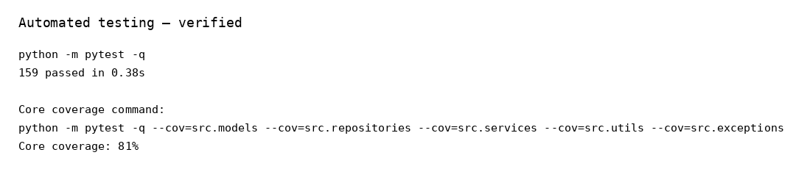

# IT0206 Assessment 2 — Test Report
## IBSU Lunch Ordering System

**Test date:** 10 September 2026  
**Environment:** Python 3.13.5 runtime used for final verification; project targets Python 3.11+  

## 1. Test Strategy

Testing combines:
1. Automated pytest tests for models, repositories, services, validators and SQL schema reproduction.
2. Negative-path tests for invalid credentials, duplicate accounts, invalid input, missing records, insufficient stock and invalid states.
3. Manual black-box functional testing of the console application.
4. User Acceptance Testing (UAT) sign-off to be completed by a human team member/stakeholder before submission.

## 2. Automated Results

```text
158 passed
0 failed
```

Core-logic/data-access coverage command result:

```text
Core source coverage: 81%
```

The overall source coverage is lower because interactive controllers, views and the entry point are primarily validated through manual end-to-end testing rather than unit tests.



## 3. Functional Test Cases

| ID | Test case | Expected result | Result |
|---|---|---|---|
| FT-01 | Launch from clean database | Application starts and seeds demo data | PASS |
| FT-02 | Student login with valid credentials | Student session opens | PASS |
| FT-03 | Student login with invalid password | Error shown; session not opened | PASS (automated) |
| FT-04 | Browse menu | Categories/items/stock displayed | PASS |
| FT-05 | Place order | Order created and stock decreases | PASS |
| FT-06 | Place order above stock | Order rejected; no partial order | PASS (automated) |
| FT-07 | View own orders | Student sees own history | PASS |
| FT-08 | Cancel received order | Order is removed and stock is restored | PASS |
| FT-09 | Attempt to cancel collected order | Cancellation rejected | PASS (automated) |
| FT-10 | Admin login | Administrator session opens | PASS |
| FT-11 | Update order status | Status changes | PASS |
| FT-12 | Search menu/order records | Matching records returned | PASS (automated/manual) |
| FT-13 | Generate reports | DataFrames and report views generated | PASS |
| FT-14 | Generate charts | PNG charts created | PASS |
| FT-15 | Import CSV/JSON | Menu rows can be read and inserted | PASS (service tests) |
| FT-16 | Export CSV/JSON/TXT | Export files created | PASS |
| FT-17 | Logging | Application log file created | PASS |
| FT-18 | Rebuild database from schema.sql | Required tables/data recreated | PASS |

## 4. Negative/Edge Cases

- Invalid menu selection.
- Non-numeric quantity.
- Zero/negative quantity.
- Negative price.
- Invalid username/password format.
- Duplicate username/category.
- Missing food/order/category record.
- Insufficient stock.
- Cancelling an already removed order is rejected as not found.
- Cancelling a collected order.
- Invalid JSON/missing files.

## 5. Defect Log and Fixes

| ID | Defect found during final review | Fix |
|---|---|---|
| D-01 | Standalone `schema.sql` did not match the live application schema (`password` vs `password_hash`, role values, order-item columns). | Rebuilt `schema.sql` to match the application and added schema regression test. |
| D-02 | `MainController` constructed `OrderRepository` without its item/status repositories, so runtime cancellation could fail to restore stock. | Wired `OrderRepository` with all required dependencies during application bootstrap. |
| D-03 | README/user manual used an incorrect `python main.py` command and outdated paths. | Updated instructions to `python -m src.main` and corrected database/log/export paths. |
| D-04 | Public method/property docstrings were incomplete relative to the rubric. | Added docstrings to all public methods/properties. |
| D-05 | Cancellation exception text incorrectly referred to status `Received`. | Updated cancellation rule to the prompt-defined received status. |
| D-06 | Order deletion was not exposed as explicit CRUD. | Added transactional `OrderRepository.delete()` and administrator menu operation. |
| D-07 | Deleting a category referenced by food items produced a raw SQLite integrity error. | Added `CategoryInUseError` and a user-facing controller message. |

## 6. UAT Sign-Off Record

UAT must be completed by an actual user/team member and signed before submission. Do not fabricate this signature.

**Tester name:** ____________________________________  
**Role:** ___________________________________________  
**Date:** ___________________________________________  
**Version/commit:** __________________________________  

I confirm that I used the application according to the User Manual and that the major workflows met the agreed acceptance criteria.

**Accepted:** Yes / No  
**Signature:** _______________________________________

## 7. Evidence Files

See `docs/screenshots/` for application/test screenshots and `docs/diagrams/` for architecture/database/class diagrams.
